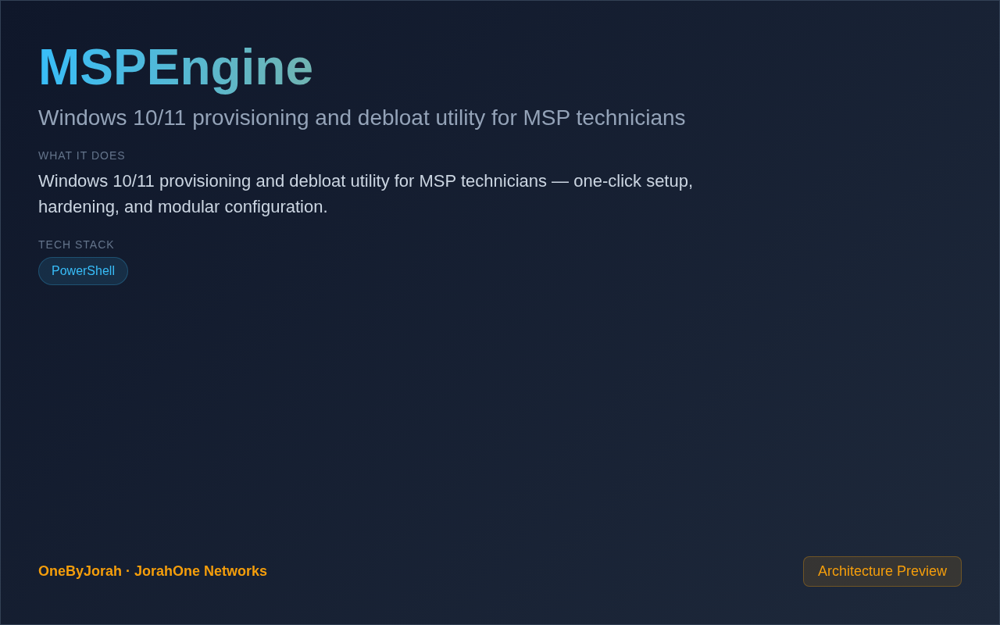

<div align="center">


# MSPEngine

Windows 10/11 provisioning and debloat utility for MSP technicians


</div>

---

<p align="center">
  
</p>

<br>

---

## Features

- **One-Click Setup** — Automate Windows deployment and configuration.
- **Debloat** — Remove unnecessary Windows components and bloatware.
- **Hardening** — Apply security best practices automatically.
- **MSP Optimized** — Designed for managed service providers.
- **Modular Design** — Enable/disable specific configuration modules.
- **Logging** — Full audit trail of all changes.
- **Silent Mode** — Run unattended for mass deployment.

## Quick Start

```powershell
git clone https://github.com/OneByJorah/MSPEngine.git
cd MSPEngine

# Run as Administrator
.\Start-MSPEngine.ps1
```

## Modules

| Module | Description |
|--------|-------------|
| **Debloat** | Remove Windows bloatware and telemetry |
| **Security** | Apply security hardening policies |
| **Network** | Configure network settings |
| **Drivers** | Install/update device drivers |
| **Software** | Deploy common applications |
| **Updates** | Configure Windows Update policy |

## Configuration

| Variable | Default | Description |
|----------|---------|-------------|
| `MODE` | `interactive` | Run mode (interactive/silent) |
| `LOG_PATH` | `.\logs` | Log file directory |
| `CONFIG_FILE` | `.\config.json` | Custom configuration file |

## Project Structure

```
MSPEngine/
├── Start-MSPEngine.ps1     # Main entry point
├── Modules/
│   ├── Debloat.ps1         # Debloat module
│   ├── Security.ps1        # Security hardening
│   ├── Network.ps1         # Network configuration
│   ├── Drivers.ps1         # Driver management
│   ├── Software.ps1        # Software deployment
│   └── Updates.ps1         # Windows Update
├── Config/
│   └── default.json        # Default configuration
├── Logs/                   # Operation logs
└── README.md
```

## Contributing

Contributions are welcome. Please see [CONTRIBUTING.md](CONTRIBUTING.md) for guidelines and [CODE_OF_CONDUCT.md](CODE_OF_CONDUCT.md) for community standards.

## Security

For security concerns, see [SECURITY.md](SECURITY.md). Please report vulnerabilities to **info@jorahone.com** — do not use public issues.

## License

MIT © Jhonattan L. Jimenez

---

## 🤝 Contributing

See [CONTRIBUTING.md](CONTRIBUTING.md). All contributions follow the [Code of Conduct](CODE_OF_CONDUCT.md).

## 🔒 Security

Found a vulnerability? Please follow our [Security Policy](SECURITY.md) and report privately to `security@jorahone.com`.

## 📄 License

[MIT License](LICENSE) © Jhonattan L. Jimenez (OneByJorah)

---

<p align="center">Built with 🌴 by <a href="https://github.com/OneByJorah">OneByJorah</a> · <a href="https://jorahone.com">jorahone.com</a></p>
